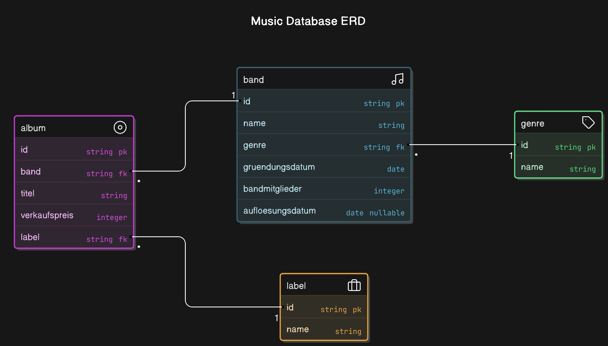

_Band_:

- ID (Automatically Generated)
- Name (String)
- Genre (Genre ID)
- Gründungsdatum (Date)
- Bandmitglieder (Integer)
- Auflösungsdatum (Date) NULLABLE (Not greater - than Gründungsdatum)

_Genre_:

- ID (Automatically Generated)
- Name (String)

_Album_:

- ID (Automatically Generated)
- Titel (String)
- Band (Band ID)
- Label (Label ID)
- Verkaufspreis (Integer)

_Label_:

- ID (Automatically Generated)
- Name (String)
