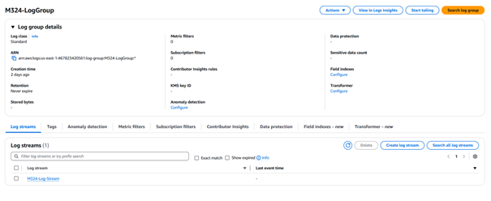
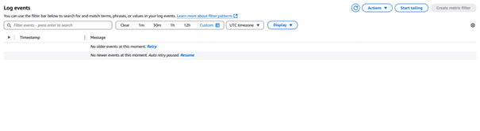
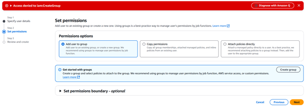
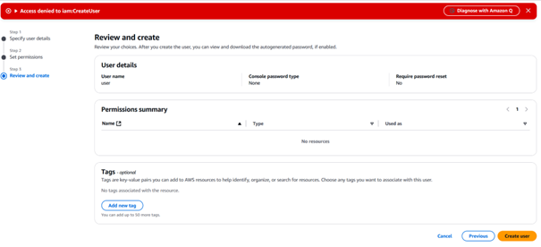
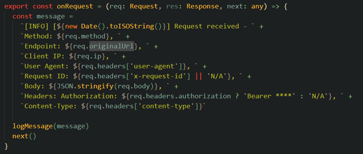
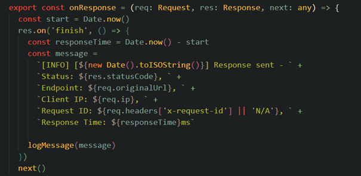
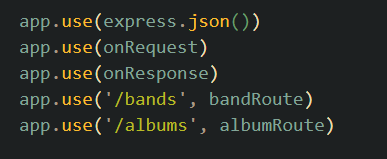
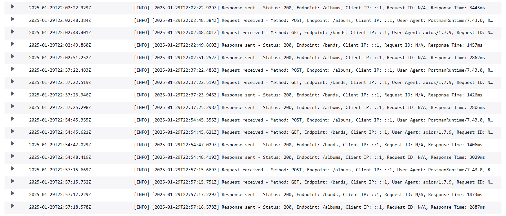
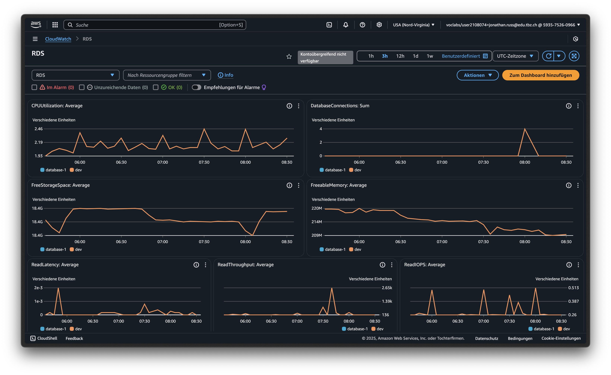
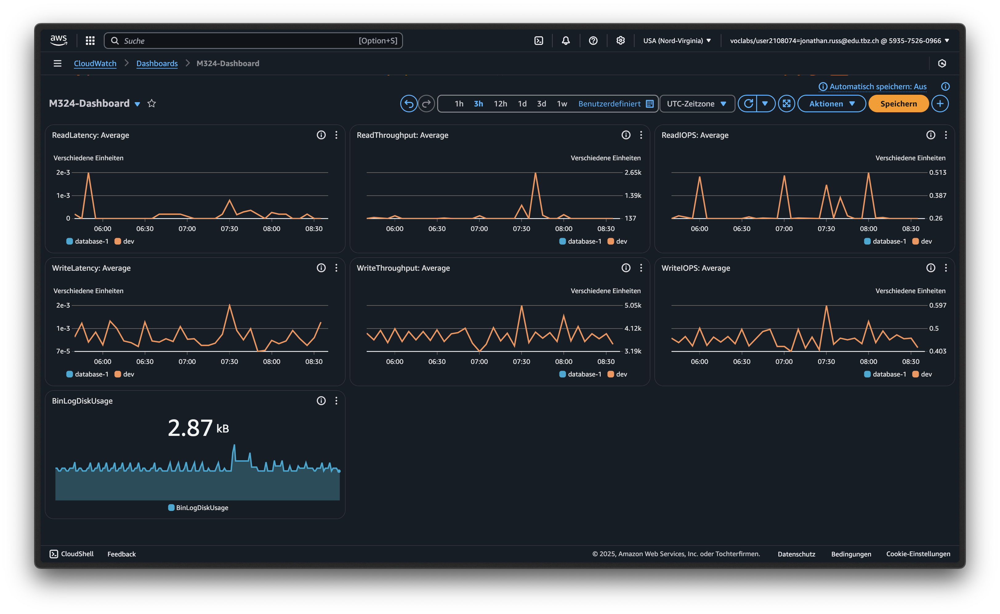

# [Continuous Monitoring](https://gitlab.com/ch-tbz-it/Stud/m324/-/blob/main/Projekt/Z3_ContinuousMonitoring.md)

## Auswahl der Lösung

Wir hatten die Idee, das Logging mit einem eigenen Backend und einem kleinen Dashboard selbst umzusetzen. Doch die Lehrperson wollte, dass wir eine bereits bestehende Lösung verwenden. Sie verwies uns auf die "Out-of-the-Box"-Lösung von AWS. Dafür haben wir uns dann auch entschieden, da unsere Datenbank bereits bei AWS gehostet ist.

## AWS Academy Learner Lab

Wir haben versucht, AWS CloudWatch im von der Lehrperson eingerichteten Learner Lab zu nutzen. Dazu haben wir uns zusammengesetzt und versucht, es in unsere App zu integrieren. Wir haben eine Log Group mit dem Namen "M324-LogGroup" erstellt.



Dazu haben wir einen Log-Stream erstellt, an den die Applikation dann die Logs sendet.



Stand Dienstagabend konnten wir noch keine Logs speichern.

## Problem IAM User

Damit unsere App die Daten an AWS senden kann, benötigt sie Zugangsdaten (Access Key), um sich bei AWS zu authentifizieren. Dafür wird ein IAM-Benutzer benötigt. Allerdings haben wir nicht die notwendigen Berechtigungen, um einen solchen Benutzer zu erstellen. Weder das Erstellen einer Berechtigungsgruppe noch das Anlegen des Benutzers selbst war möglich.




Wir haben dieses Problem der Lehrperson gemeldet, aber aufgrund einer Erkrankung konnte sie uns nicht weiterhelfen. Eine alternative Möglichkeit bestand darin, das Logging mit einem eigenen AWS-Account umzusetzen.

## Lösung mit eigenem AWS Account

Ich habe den gesamten Prozess auf meinem privaten AWS-Account erneut durchgeführt und anschliessend die Umgebungsvariablen in die .env-Datei unserer App eingefügt.

```.env
AWS_ACCESS_KEY_ID=
AWS_SECRET_ACCESS_KEY=
AWS_REGION=eu-central-1
AWS_LOG_GROUP_NAME=M324-Loggroup
AWS_LOG_STREAM_NAME=M324-Logstream
```

Danach habe ich den Code eingerichtet, der das Senden der Logs an AWS ermöglicht, und die Middleware konfiguriert.

Eine Middleware verarbeitet die Requests:



Eine weitere Middleware verarbeitet die Responses:



Die Funktion `logMessage()` sendet die Logs an den Log Stream. Die Logik dazu kann in der Datei `awsMiddleware.ts` nachgelesen werden.

Ein Problem war die Anordnung der Middlewares. Da Expressjs die Middlewares in der Reihenfolge aufruft, wie sie hinzugefügt werden ist die Anordnung wichtig. So wie im Bild hat es dann schlussendlich funktioniert. Bei einer Request muss zuerst die express.json() Funktion aufgerufen werden. Erst dann kann ich mit meiner eigenen Middleware den Body auslesen. Dann kommen meine Middlewares und zum Schluss die Routes bzw. die Endpunkte.



Die fertigen Logs im Backend sehen wie folgt aus:


# Database Monitoring

Unsere Datenbank ist bei AWS gehostet. Dadurch können wir uns in CloudWatch verschiedene Metriken anzeigen lassen.
Beim Erstellen eines Dashboards für RDS fügt AWS automatisch mehrere Metriken hinzu.



Erstellt man das Dashoard, können eigene Metric-Widgets hinzugefügt werden. Dies haben wir für die `BinLogDiskUsage` gemacht. Es gibt zahlreiche weitere Metriken, die hinzugefügt werden können.


